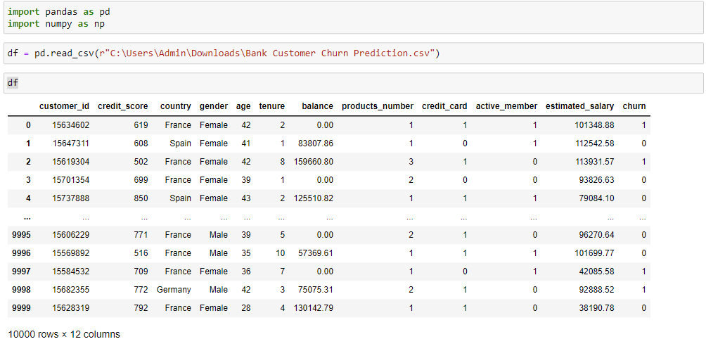

<html>
 <head>
  GROUP 4
 </head>
 
 <body>
  <h1 style="font-size:40px;text-align:center;color:#704362;"> <b>MINI-PRESENT   BANK CUSTOMER CHURN </b></h1>
  
 <i>Phạm Thị Thu Hà - Lê Thiên Nhi - Nguyễn Phan Hoàng Duy - Đinh Hoàng Dương - Trương Quang Duy - Hoàng Quang Minh </i>

  <h2> 1.INTRODUCTION </h2>
  
Churn prediction is the practice of determining which customers are most likely to discontinue or cancel their subscription to a service. This is an important consideration for many firms because obtaining new customers is more expensive than retaining existing ones..

Every year, the banking industry has one of the highest rates of client attrition. The expanding market competitiveness, which provides customers with more options and better offers, is one of the primary drivers of client attrition for retail banking firms. In order to detect early signs of potential customer churn, banks must obtain a full, 360-degree view of their client base and their interactions across several channels. They would be able to detect early warning signs of client churn, such as a decrease in transactions or a drop in sales..

This project uses customer data to analyze and anticipate customer attrition for 'ABC Multinational Bank,' a fictitious bank. The ABC Multinational Bank dataset shows which clients have left, stayed, or signed up for their services. Each customer has multiple critical demographics that can help us identify at-risk customers, pain spots, and actions to be performed...

<h2> ABOUT DATASET </h2>

This dataset is for ABC Multinational bank with following columns:
 
-customer_id, unused variable.
 
-credit_score, used as input.
 
-country, used as input.
 
-gender, used as input.
 
-age, used as input.
 
-tenure, used as input.
 
-balance, used as input.
 
-products_number, used as input.
 
-credit_card, used as input.
 
-active_member, used as input.
 
-estimated_salary, used as input.
 
-churn, used as the target. 1 if the client has left the bank during some period or 0 if he/she has not.
 
Aim is to Predict the Customer Churn for ABC Bank.

<h2> 2. DATA VISUALIZATION </h2>

 </body>
</html>
