<html>
 <head>
  GROUP 4
   
TS. Emmanuel Plan
 ThS. Hoàng Nguyễn Quốc Thành
 </head>
 
 <body>
  <h1 style="font-size:40px;text-align:center;color:#704362;"> <b>MINI-PRESENT   BANK CUSTOMER CHURN </b></h1>
  
 <i>Phạm Thị Thu Hà - Lê Thiên Nhi - Nguyễn Phan Hoàng Duy - Đinh Hoàng Dương - Trương Quang Duy - Hoàng Quang Minh </i>

  <h2> 1.INTRODUCTION (Nguyen Phan Hoang Duy) </h2>
  
Churn prediction is the practice of determining which customers are most likely to discontinue or cancel their subscription to a service. This is an important consideration for many firms because obtaining new customers is more expensive than retaining existing ones..

Every year, the banking industry has one of the highest rates of client attrition. The expanding market competitiveness, which provides customers with more options and better offers, is one of the primary drivers of client attrition for retail banking firms. In order to detect early signs of potential customer churn, banks must obtain a full. They would be able to detect early warning signs of client churn, such as a decrease in transactions or a drop in sales..

This project uses customer data to analyze and anticipate customer attrition for 'ABC Multinational Bank,' a fictitious bank. The ABC Multinational Bank dataset shows which clients have left, stayed, or signed up for their services. Each customer has multiple critical demographics that can help us identify at-risk customers, pain spots, and actions to be performed...

<h2> ABOUT DATASET </h2>

This dataset is for ABC Multinational bank with following columns:
 
-customer_id, unused variable.
 
-credit_score, used as input.
 
-country, used as input.
 
-gender, used as input.
 
-age, used as input
 
-tenure, used as input.
 
-balance, used as input.
 
-products_number, used as input.
 
-credit_card, used as input
 
-active_member, used as input.
 
-estimated_salary, used as input.
 
-Churn, used as the target. 1 if the client has left the bank during some period or 0 if he/she has not.
 
Aim is to Predict the Customer Churn for ABC Bank.

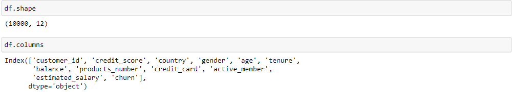
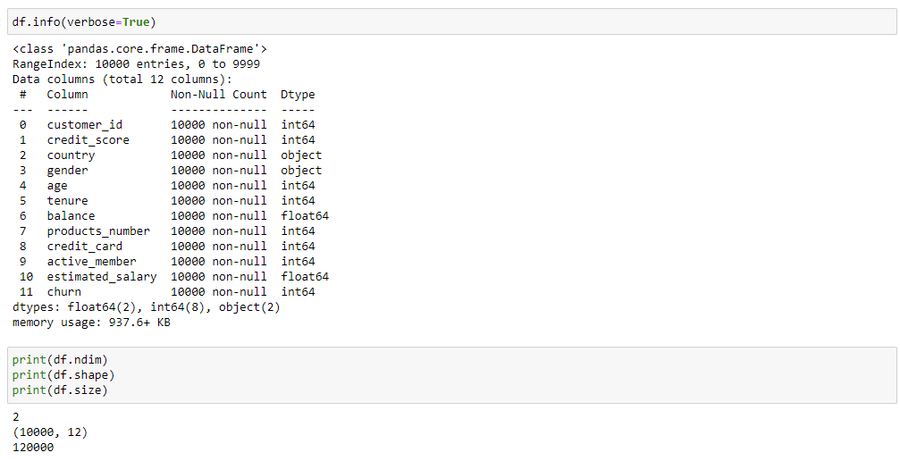
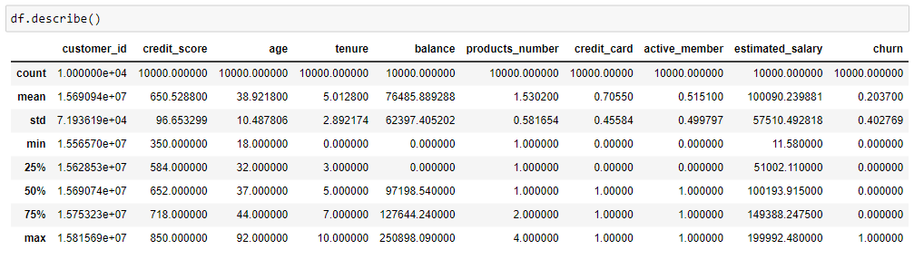
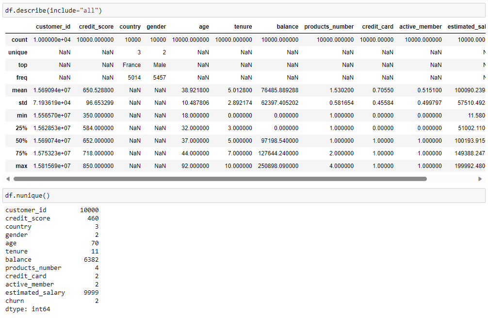
<h2> 2. DATA VISUALIZATION </h2>

Data visualization is an important method in the data exploration process and conveying information. By using charts, graphs, and plots, we can visually display relationships, trends, and patterns in data. This helps us gain deeper insights into the data and make informed decisions based on that information.

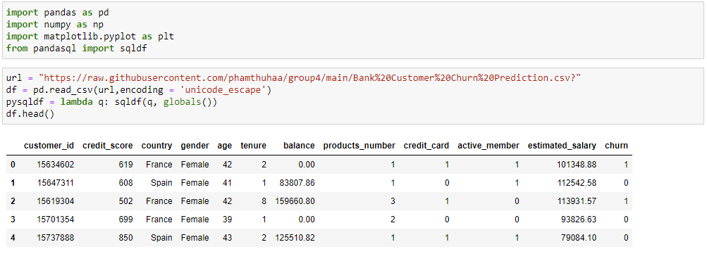
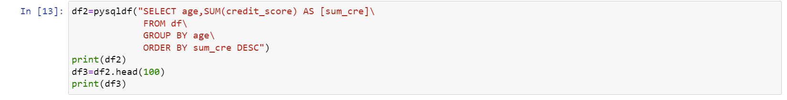
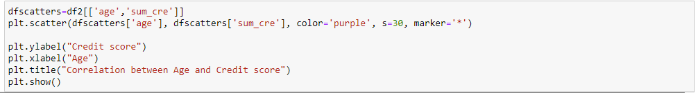
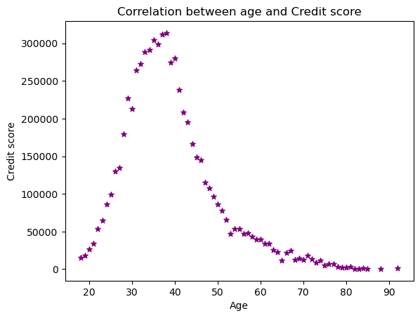
<h3> Pham Thi Thu Ha </h3>

Looking at the chart, we can see the total credit scores based on different age ranges. From there, we can deduce the risk level of customers. From the age range before 20 and from 50 to 90 years old, we can assess these as high-risk customer profiles because individuals under 20 years old usually lack financial experience and credit history, while those between 50 and 90 years old often have a higher risk of high debt levels, resulting in lower credit scores. On the other hand, the age range from 30 to 40 years old is a range with high total credit scores because customers in this age group typically have stable income, leading to higher credit scores. Therefore, they can be classified into the low-risk group.

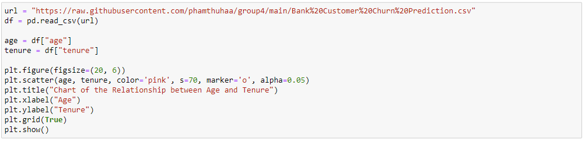
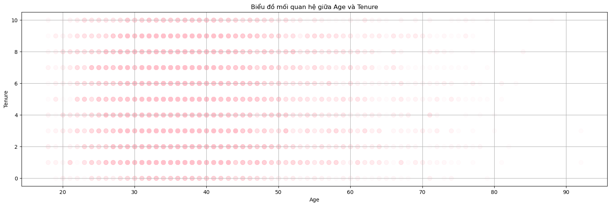
<h3> Le Thien Nhi </h3>

We used a scatter plot chart to display associations between age and tenure. Tenure is how many years he/she has a bank account in the Bank. We used alpha = 0,05 because this can be helpful when we have a large dataset, as it allows us to visualize the overall distribution of data points while still being able to see areas of high density.
After 50, the pink dots tend to fade and are almost non-existent beyond the age of 80. From this, we can see that older people use bank accounts less frequently. In contrast, for ages between 25 and 50, the pink dots are very dark and spanning from 1 to 10 years.

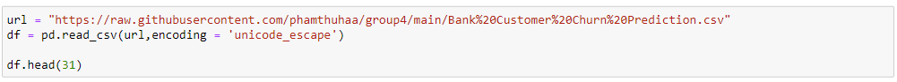
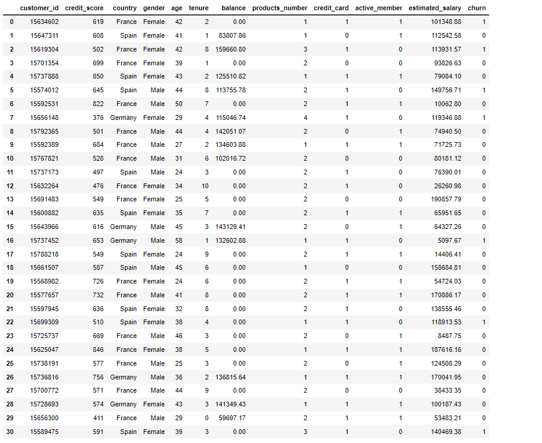
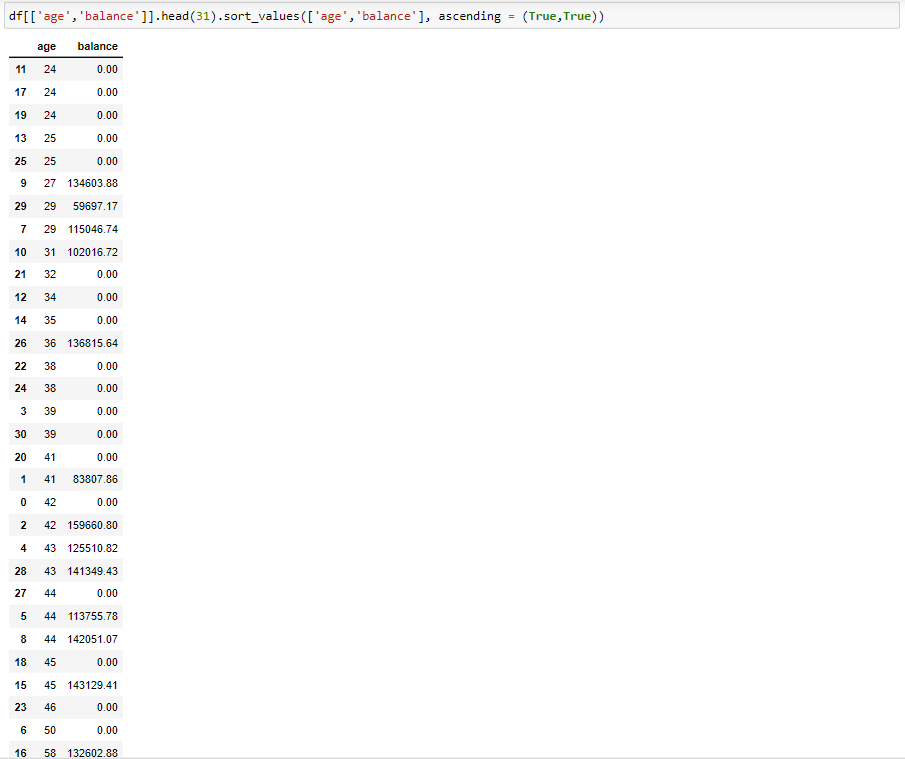

  age = np.array([24,24,24,25,25,27,29,29,31,32,34,35,36,38,38,39,39,41,41,42,42,43,43,44,44,44,45,45,46,50,58])
 balance = np.array([0.0,0.0,0.0,0.0,0.0,134603.88,59697.17,115046.74,102016.72,0.0,0.0,0.0,136815.64,0.0,0.0,0.0,0.0,0.0,83807.86,0.0,159660.8,125510.82,141349.43,0.0,113755.78,142051.07,0.0,143129.41,0.0,0.0,132602.88])
  
 sorted_indices = np.argsort(age)
 sorted_age = age[sorted_indices]
 sorted_balance = balance[sorted_indices]
  
 plt.figure(figsize=(12,7))
  
 plt.plot(sorted_age, sorted_balance, linewidth=2.8)
 plt.xlabel('Age')
 plt.ylabel('Balance')
 plt.show()

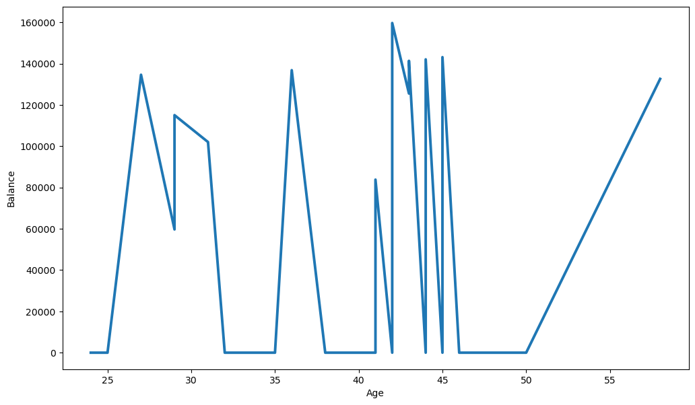
<h3> Dinh Hoang Duong chart 1 </h3>

 First, we can see that ages with account balances ranging from 110,000 - 140,000 are distributed very evenly among different ages but mainly concentrated in the ages 25-30 and 41-45 years old. And the number of zero account balances also exists a lot in the range of 32 - 42 years old and from 46 - 50 years old.

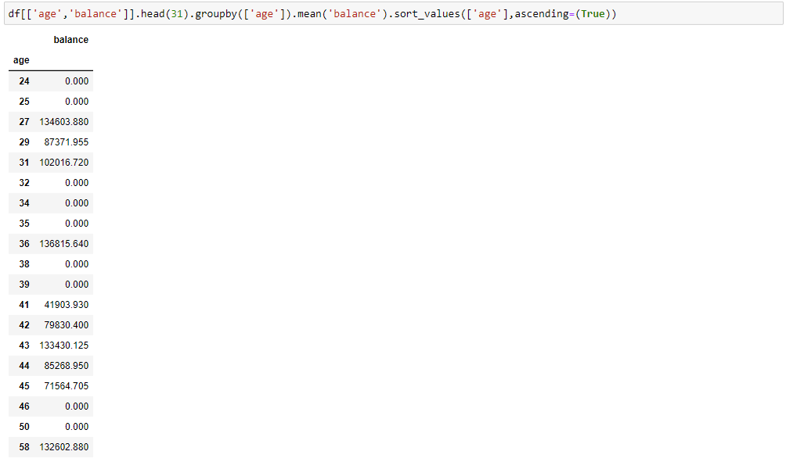
<h3> Dinh Hoang Duong chart 2 </h3>

 age = np.array([24,25,27,29,31,32,34,35,36,38,39,41,42,43,44,45,46,50,58])
 balance = np.array([0,0,134603.88,87371.955,102016.72,0,0,0,136815.64,0,0,41903.93,79830.4,133430.125,85268.95,71564.705,0,0,132602.88])
  
 sorted_indices = np.argsort(age)
 sorted_age = age[sorted_indices]
 sorted_balance = balance[sorted_indices]
  
 plt.figure(figsize=(10, 6))
  
 plt.plot(sorted_age, sorted_balance)
 plt.xlabel('Age')
 plt.ylabel('Balance')
 plt.show()

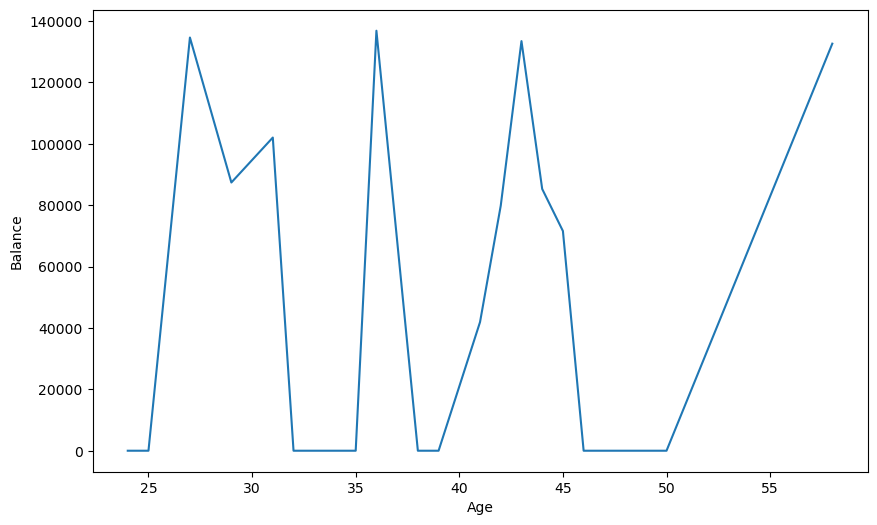

In the chart on the right, that's the average value of the account balance at each age. I will divide this chart into 2 age groups, first from 24-40 and then from 40-60

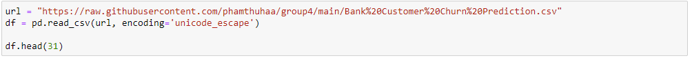
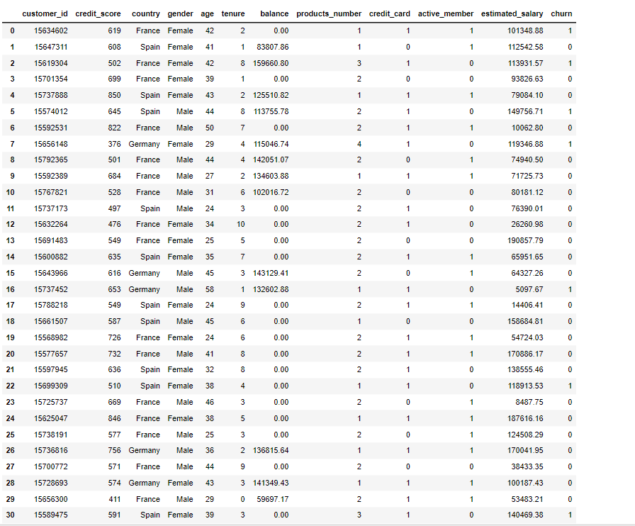
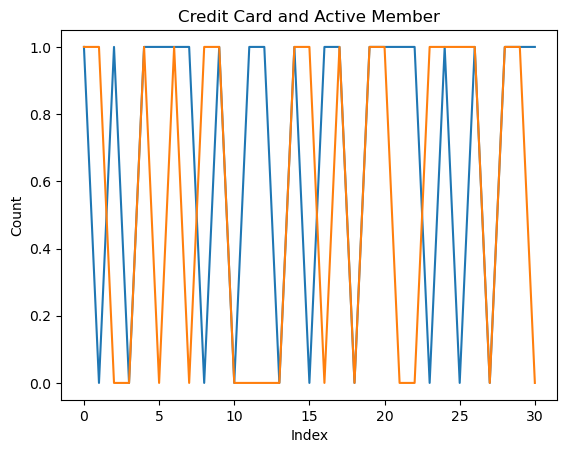
<h3> Truong Quang Duy </h3>

 We can see that the number of people using both Credit Card and Active Member is 40%. This is followed by 40% of people using only 1 of the two categories. And the number of people who don't take both is 20%. Looking at the graph, we see that the number of people participating in the strategy is 80%, but there are still a few people who are not interested in this.

<h2> 3. CONCLUSION (Hoang Quang Minh) </h2>

Overall, the shown 4 chart determined the customer churn’s condition in the world today. Firstly, it shown some aspects like Credit score, tenure, Active Member and the Average Account balance. Through that, we can comment on the general state of the economy in general, the situation of using financial services in particular of people of different ages. The use of financial services is increasing, accompanied by assimilation at different ages This is a very positive signal and can be used to make more professional and in-depth assessments for different purposes

 

 All data come from "https://www.kaggle.com"

<h1 style="font-size:40px;text-align:center;color:#704362;"> <b>THANK YOU FOR LISTENING </b></h1>
 </body>
</html>
